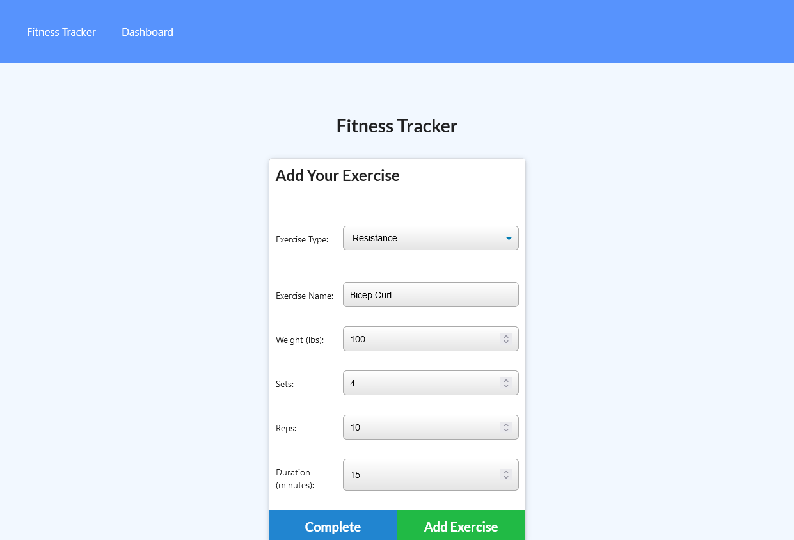
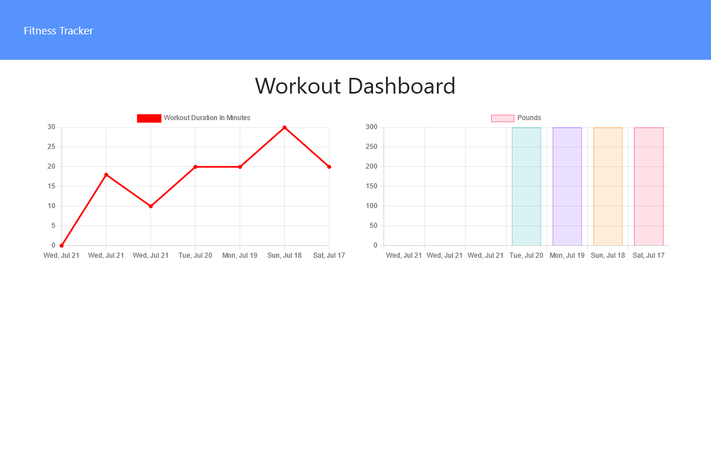

# Fitness-Tracker
## A site to track your workouts.

## Description:
This site allows your you create new workouts, and add individual resistance or cardio exercises to those workouts. You can view your workout history on the dashboard.

## Table of Contents:
[User Story](#User-Story) 
[Installation](#Installation) 
[Usage](#Usage) 
[Tests](#Tests) 
[Contributions](#Contributions) 
[Contact](#Contact) 
[License](#License) 

## User Story:
- AS AN active individual
- I WANT a site that asks basic questions
- SO THAT I can log and track my workout routines.

## Installation:

## Usage:
Image: 
 
Image: 
 
Image: 
 

## Tests:
No tests are currently included.

## Contributions:
Technologies used include JavaScript, Node.js, Express, and MongoDB.

## Contact:
Check out my [Github](https://github.com/MonsAltus). 
Email me at <hacklander.dev@gmail.com>

## License:
Covered under the [MIT License](https://github.com/MonsAltus//Fitness-Tracker/blob/main/LICENSE).
